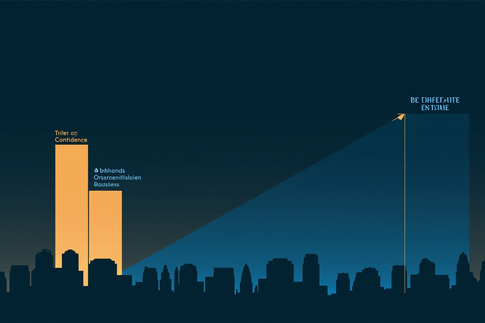

McKinsey's State of Grocery Retail MENA 2026 contains a finding that should concern every operator in the Gulf: confidence is up, store openings are up, and revenue growth has slowed. More activity. Less result.

This is the growth paradox — and it's not a data problem.

## What the Numbers Actually Show

The report documents organizations with rising consumer confidence, active expansion pipelines, and more infrastructure investment than any prior period — producing slower growth than the sentiment would predict. The companies being described aren't data-poor. They have the data. They have the teams. What they lack is a system that converts information into a decision before the competitive window closes.

The symptom reads as a market or macro problem. The actual failure is operating. These organizations have more dashboards than two years ago and slower decision cycles than two years ago. The investment in data infrastructure hasn't shortened the path from information to action.

## The Decision Velocity Gap

The core problem isn't analytics maturity. It's decision velocity — the speed at which an organization can take available information, apply named criteria, and produce a committed action.

Organizations with high decision velocity don't necessarily have better data. They have clearer ownership: who decides what, by when, based on which information. They have review rhythms built around decisions, not around report delivery. They have metric definitions that were built to enable a specific outcome, not to be comprehensive.

The teams solving this aren't doing it with better BI tools. They're going back to the operating layer — the decision calendar, the criterion for each decision, the single named owner — and rebuilding the analytics work from that question forward.

## What This Looks Like in Practice

A retail organization in the Gulf had 14 separate Excel files feeding into its weekly management review. Each file was maintained by a different analyst. When one analyst left, two weeks of institutional knowledge left with her. The replacement spent her first month reverse-engineering formulas instead of finding patterns.

The management team had all the data. They didn't have a decision system. The weekly review was a data reconciliation exercise, not a decision meeting. By the end of the quarter, nothing had changed — the numbers were more consistent, but the decisions were the same.

Eight weeks later, the review ran off one live dashboard. Three numbers. One decision per week, owned by a named person, with a consequence for getting it wrong. The other 13 files were retired.

The result wasn't a better data model. It was a decision that happened on Friday instead of the following Wednesday.

## Why the Paradox Persists

Most analytics transformations are measured by outputs: dashboards shipped, pipelines built, tools deployed. These are easy to count and report upward. They don't measure what changed at the decision layer — and they don't need to, because nobody asked for that measurement.

The organizations experiencing the growth paradox McKinsey described aren't failing at analytics. They're succeeding at the wrong goal. Building a more complete data model while the decision layer stays the same doesn't produce faster decisions. It produces more informed debates about the same unresolved questions.

The fix requires asking a different question before the next analytics project: what specific decision does this need to enable, and who owns it? Not "give the team visibility." Not "track performance." Specific: by the 10th of each month, this person approves or rejects this allocation — without a follow-up meeting.

That's a decision. Everything else is documentation.

If your organization's decision speed doesn't match your market's growth — that's the gap worth closing first.
